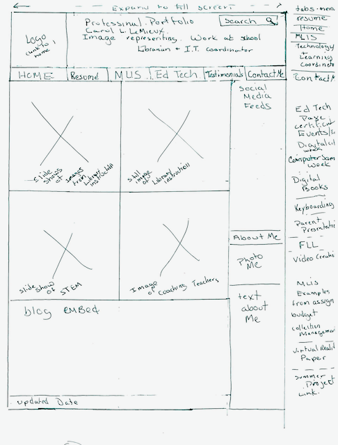
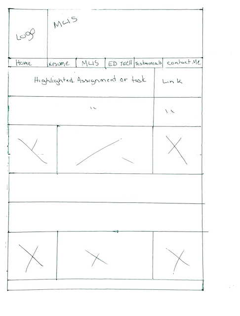
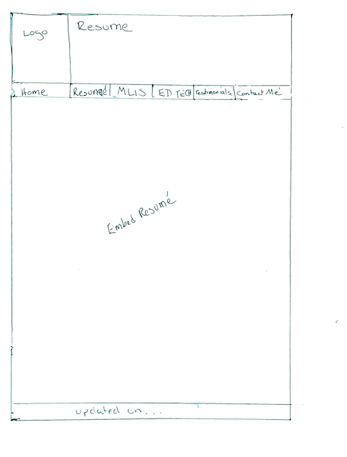
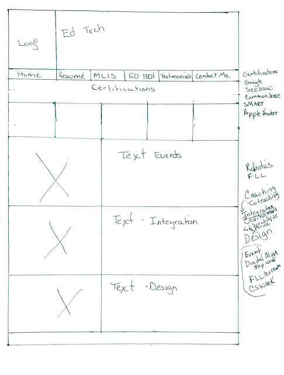

# Carol LeMieux's portfolio website

A portfolio site showcasing my professional Work as an Ed Technology Coordinator and Coach and  my MLIS Preparation and Working Experience. I am including both as I hope to combine these two skills in my next teaching librarian position

## First Wireframe

- The Header
  - Inlcude a Logo of my initials and an image overlaid with the site name.
  - There will be a search bar.
  - Just below this will be a horizontal navigation bar
    - The navigation bar will have links to other pages
    - a page highlighting my MLIS journey and two years as a secondary librarian
    - an edtech page about my experience as a technology coordinatory and edtech coach
    - a page for my resume
    - a testimonial page
    - a contact me page
- The body
  - images of me in context of library and Ed tech.
  - My blog will be embedded towards the bottom.
  - The right side bar will have social media feeds and an about me section.
- The footer will have copyright and update information.

## Second Wireframe

- The header
  - Same as the landing page
  - have page name rather than site name.
- The navigation bar
  -will be the same for each page.
- Body
  - The page will have 1 row for each testimonial.
  - Beside each testimonial will be the context from which the testimonial was gathered.

## Third Wireframe

This page has a contact form and professional social media contacts

## Fourth Wireframe

This page will highlight  learning outcomes with links to assignments that illustrate the learning. It will also feature content from my two years experience as the secondary librarian at Suzhou Singapore International School in China.

## Fifth Wireframe

This will contain my resume; en embeded PDF document

## Sixth Wireframe

This page will highlight my experience in edtech. The top rows will be my certifications with various ed tech platforms. There will be a horizontal box to highlight my design teaching experience, expertise with learning and technology integration, and ed tech events.
